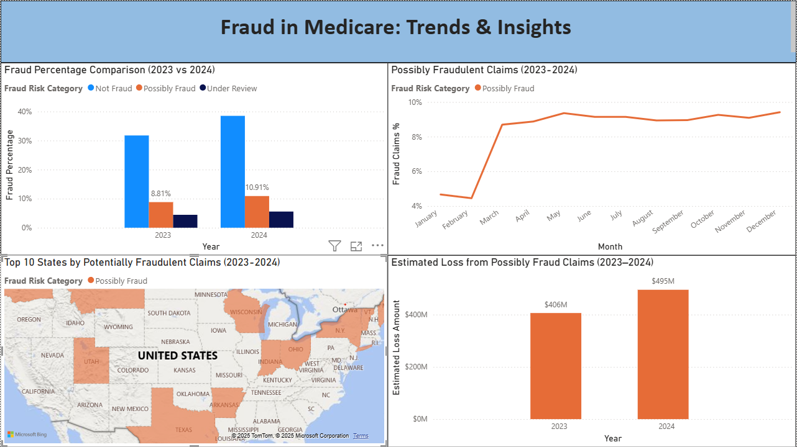
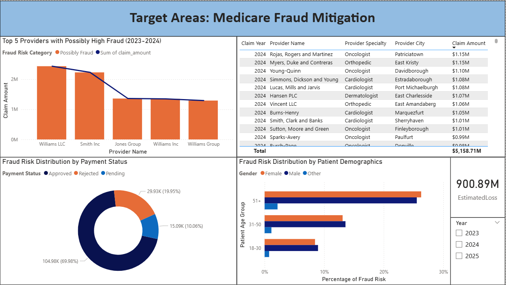

# Medicare Fraud Detection: A Data-Driven Strategy

A machine learning and analytics project that detects and prevents Medicare fraud using public Medicare Part D datasets, predictive modeling, and interactive Power BI dashboards.

## 📋 Project Overview

Medicare serves over **60 million Americans**, providing essential healthcare to seniors and individuals with disabilities. In 2024, improper payments in Medicare Part D were estimated at over **$50 billion**, indicating significant financial leakage.

This project presents a data-driven strategy to proactively detect fraudulent claims, reduce improper payments, and enable smarter audits for CMS investigators.

Built as a group project for the **Data Driven Organization** course at Yeshiva University.

## 🎯 Expected Measurable Impact

| Metric | Value |
|--------|-------|
| Fraud Loss Savings | **$10 million+** by catching fraud earlier through real-time detection |
| Detection Speed | Reduce flagging time from **7 days to 24 hours** |
| Part D Improper Payments | **Lower by 10%** to protect Medicare funds |
| Risky Claims Flagged | **95% before payment** to stop fraudulent payouts |
| Automated Screening | **85% of claims** screened automatically, reducing manual checks |
| Staff Training | **100% of fraud staff** trained on new tools and dashboards |

## 📊 Dashboards

We developed **two interactive Power BI dashboards** to help CMS understand Medicare fraud patterns and prioritize actions. Both feature drill-downs, dynamic filters, and cross-visual filtering for real-time exploration.

### Dashboard 1: Fraud Trends & Impact Overview
Provides a high-level view of fraud trends and impact across time and geography.



### Dashboard 2: Provider & Regional Deep Dive
Focuses on deeper insights to identify key areas and actors for potential intervention.



## 📂 Project Structure

```
GroupA_Project_Medicare_Fraud_Detection/
├── assets/images/                                            # Dashboard screenshots
├── Medicare Fraud Detection_ A Data-Driven Strategy.pptx   # Presentation slides
├── Medicare_Fraud_Dashboards.pbix                            # Power BI dashboards
├── Medicare_Fraud_Report.pdf                                 # Full project report
├── Datasets_Medicare.zip                                     # Source data (Kaggle Medicare datasets)
├── Dashboard_Demo.zip                                        # Dashboard demo video
└── README.md                                                 # This file
```

## 🛠️ Tools & Technologies

- **Languages:** Python (Pandas, Scikit-learn, XGBoost, Random Forest, Logistic Regression)
- **Visualization:** Power BI (interactive dashboards with drill-downs and cross-visual filtering)
- **Data Sources:** Medicare Healthcare Fraud Detection datasets from Kaggle (2023–2025)
- **Techniques:** Feature Engineering (40+ attributes), Machine Learning, Rule-Based Filters, Risk Scoring

## 📈 Methodology

1. **Data Collection** — Used Medicare Part D datasets (2023–2025) from Kaggle covering provider-level prescription activity, costs, and claim outcomes
2. **Feature Engineering** — Engineered **40+ attributes** reflecting prescription behavior, cost patterns, and geographic trends
3. **Geographic Mapping** — Aggregated features at ZIP code level to identify regional fraud patterns
4. **Model Training** — Applied Random Forests, XGBoost, and Logistic Regression trained on labeled historical claims
5. **Risk Scoring** — Combined rule-based filters with predictive models for automated claim screening
6. **Dashboard Development** — Built two interactive Power BI dashboards for CMS investigators and policy teams
7. **Feedback Loop** — Proposed quarterly model retraining using investigator feedback

## 🚀 Strategic Recommendations

1. **Phased Rollout** — Start with high-risk regions and specialties before scaling nationally
2. **Automated Monitoring** — Implement real-time fraud scoring with model transparency
3. **Cross-Agency Collaboration** — Partner with CMS, OIG, and state Medicaid offices
4. **Continuous Improvement** — Automate data refreshes, improve model explainability (SHAP values), and pilot in high-risk regions

## 📄 Files Description

| File | Description |
|------|-------------|
| `Medicare_Fraud_Report.pdf` | Complete project report with data sources, methodology, models, and recommendations |
| `Medicare Fraud Detection_ A Data-Driven Strategy.pptx` | Presentation slides summarizing the project |
| `Medicare_Fraud_Dashboards.pbix` | Power BI dashboard files for provider risk profiling and anomaly detection |
| `Datasets_Medicare.zip` | Medicare Part D datasets from Kaggle (2023–2025) |
| `Dashboard_Demo.zip` | Demo files showcasing the Power BI dashboard capabilities |

## 📜 License

This project is licensed under the MIT License — see the [LICENSE](LICENSE) file for details.

## ⚠️ Disclaimer

This project is for **academic and educational purposes only**. It uses publicly available Medicare data and does not contain any personally identifiable information (PII) or protected health information (PHI).
